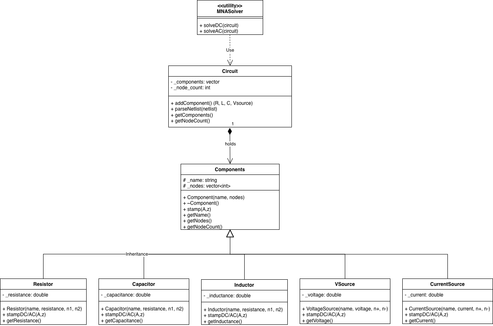

# Source content
This folder should contain only hpp/cpp files of your implementation. 
You can also place hpp files in a separate directory `include `.

You can create a summary of files here. It might be useful to describe 
file relations, and brief summary of their content.

## Build instructions:

1. Clone the repository.
```sh
# Clone the repository with submodules
git clone --recurse-submodules git@version.aalto.fi:cpp-2025/circuit-simulator-3.git

# Initialize and update any nested submodules
cd circuit-simulator-3
git submodule update --init --recursive
```

2. Configure the build system by running CMake.
```sh
cmake -B build
```

3. Build the project.
```sh
cmake --build build
```

4. Run the project.
```sh
./build/circuit-simulator
```

## Backend UML class diagram
